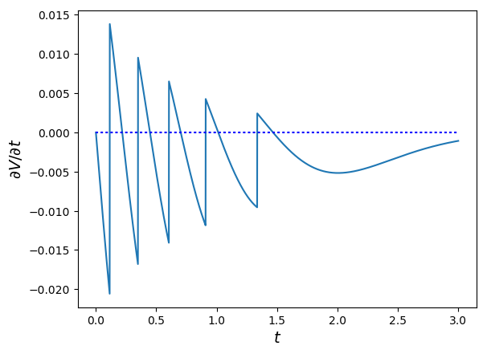

#+OPTIONS:    H:2 num:nil toc:nil \n:nil  TeX:t LaTeX:t skip:nil d:(HIDE) tags:not-in-toc 
#+STARTUP:    align fold nodlcheck hidestars oddeven lognotestate hideblocks
#+LANGUAGE:   en
#+OPTIONS: html-postamble:nil

@@html: 
<head>
<meta name="description" content="Personal website of Christoph Schottmueller">
<meta name="keywords" content="Christoph, Schottmuller, Schottmueller, Microeconomics, Microeconomic Theory, Mechanism Design, Contract Theory, Cologne, Koeln, Copenhagen, Tilburg, Economics, University">
<meta content="en-gb" http-equiv="Content-Language">

</head>
@@

@@html:

[<a href="#research">research</a>] [<a href="#teaching">teaching</a>] [<a href="#links">links</a>] 

<section id="contact">

 
<b>Christoph Schottmüller</b> is professor at the <a href="https://www.wiso.uni-koeln.de/en/en/">University of Cologne</a>.

address:     
     University of Cologne   
    Lehrstuhl Mikroökonomik (Prof. Schottmüller), SSC   
     Albertus Magnus Platz   
      50923 Köln  

office: SSC 4.207  
email: c [dot] schottmueller [at] uni-koeln [dot] de   
OpenPGP: 
   fingerprint: 4440 CA9B D857 D953 FCE7 DAB1 C647 DAB1 8A74 E0AD  
   public key <a href="files/c.schottmuellerATuni-koeln.de0xC647DAB18A74E0ADpub.asc">here</a>  
 
<b> <a href="cv.pdf">CV</a> </b>

</section>

<section id="research">
@@

* Research
** Work in progress
Welfare optimal information structures in bilateral trade [[./papers/msinfo/MSinfo.pdf][draft]]

** Working Papers
Why Echo Chambers are Useful (with Ole Jann), [[./papers/echoChamber/echo_chambers.pdf][paper]] [[./papers/echoChamber/supMatEchoChambers.pdf][supplementary material]]
@@html:     covered on <a href="https://marginalrevolution.com/marginalrevolution/2018/11/maybe-echo-chambers-evolving-efficient.html">Marginal Revolution</a> and <a href="https://stumblingandmumbling.typepad.com/stumbling_and_mumbling/2018/10/echo-chambers-a-defence.html"> Stumbling and Mumbling</a>    @@

Competing with big data (with Jens Prüfer) [[./papers/tipping/Competing with Big Data.pdf][paper]] [[./papers/tipping/CompWithBigDataSlides.pdf][slides]]  [[./papers/tipping/TippingNumeric.zip][numerics]]

Why are vulnerable regimes stable? Defending against coordinated attacks through unpredictability (with Ole Jann) [[./papers/panopticon/panopticon.pdf][paper]] [[./papers/panopticon/hamburg.pdf][slides]] [[./papers/panopticon/presentation25.pdf][slides25]]
@@html:   Former title: "How Jeremy Bentham would defend against self-fulfilling attacks" @@

Stochastic mechanisms and quasilinear preferences (with Jan Boone) [[./papers/stochastic_mechanism/stochastic_mech_quasilin_pref.pdf][paper]] (inactive)

** Publications
Too good to be truthful: Why competent advisers are fired [[./papers/dynAdvReputation/reputation.pdf][paper]] [[./papers/dynAdvReputation/supMatReputation.pdf][supplementary material]], accepted for publication in the /Journal of Economic Theory/

Do health insurers contract the best providers? Provider networks, quality and costs (with Jan Boone) [[./papers/selective_contracting/selective-contracting.pdf][paper]] [[./papers/selective_contracting/presentation.pdf][slides]],  accepted for publication in the /International Economic Review/, [[https://doi.org/10.1111/iere.12383][doi]]

An informational theory of privacy (with Ole Jann) [[./papers/privacy/privacy.pdf][paper]] [[./papers/privacy/supplementary_privacy.pdf][supplementary material]] [[./papers/privacy/presentations/EEA17.pdf][slides]], accepted for publication in the /Economic Journal/

Facilitating consumer learning in insurance markets: What are the welfare effects? (with Johan Lagerlöf) [[./papers/endogenous_info/insurance-binary.pdf][paper]], /Scandinavian Journal of Economics/ [[https://dx.doi.org/10.1111/sjoe.12231][doi]], Vol. 120 (2), April 2018, pp. 465-502
@@html:  
    supplementary material: <a href="papers/endogenous_info/Insurance-binary-Supp-Mat.pdf">here</a>, Python code: <a href="papers/endogenous_info/current_example290414.py">here</a> @@

Monopoly insurance and endogenous information (with Johan Lagerlöf) [[./papers/endogenous_info/Continuum-Round2-v2.pdf"][paper]] [[./papers/endogenous_info/EEA.pdf][slides]], /International Economic Review/ [[https://dx.doi.org/10.1111/iere.12268][doi]], Vol. 59, February 2018, pp. 233-255 
@@html:     new supplementary material: <a href="papers/endogenous_info/Continuum-Round2-sup-mat-v2.pdf">here</a>, Python code: <a href="papers/endogenous_info/current_example1113.py">here</a> and <a href="papers/endogenous_info/current_example_1113_discont_graph.py" target="_blank">here</a>   @@

Health insurance without single crossing: why healthy people have high coverage (with Jan Boone), [[./papers/health_insurance_no_sc/health_no_sc_2013.pdf][wp]] [[./papers/health_insurance_no_sc/health_ins_no_sc_web.html][ Q & A]], /Economic Journal/ [[https://dx.doi.org/10.1111/ecoj.12242][doi]], Vol. 127 (599), February 2017, pp. 85-104 
@@html:     supplementary material: see <a href="https://sites.google.com/site/janboonehomepage/home/webappendices">here</a> @@

Procurement with specialized firms (with Jan Boone) [[./papers/procurement_specialized_firms/procurement_specialized.pdf][wp]], /RAND Journal of Economics/ [[https://dx.doi.org/10.1111/1756-2171.12143][doi]], Vol. 47, Fall 2016, pp. 661-687 
@@html:  
    supplementary material: <a href="papers/procurement_specialized_firms/supplementary4.pdf">here</a> @@

Adverse selection without single crossing: monotone solutions,  [[./papers/adv_sel_no_single_crossing/revision3c2.pdf][preprint]] including webappendix, /Journal of Economic Theory/ [[http://dx.doi.org/10.1016/j.jet.2015.04.002][doi]], Vol. 158, July 2015, pp. 127-164
@@html: 
    supplementary material: <a href="papers/adv_sel_no_single_crossing/numerical_example_1_corrected.nb">main text example</a>, <a href="papers/adv_sel_no_single_crossing/demand_elasticities_example2d.py">interior binding ic</a>, <a href="papers/adv_sel_no_single_crossing/numerical_example_2.nb">bunching example</a>   @@

Correlated equilibria in homogeneous good Bertrand competition (with Ole Jann), [[./papers/correlated_eq_bertrand/bertrand.pdf][preprint]], /Journal of Mathematical Economis/ [[http://dx.doi.org/10.1016/j.jmateco.2015.01.005][doi]], Vol. 57, March 2015, pp. 31-37

Cost incentives for doctors: A double-edged sword, [[./papers/cost_incentives_doctors/revision2b.pdf][preprint]], [[./papers/cost_incentives_doctors/cost_incentives_for_doctors.html][Q & A]], /European Economic Review/ [[http://dx.doi.org/10.1016/j.euroecorev.2013.03.001][doi]], Vol. 61, July 2013, pp. 43-58 

@@html:

</section>

<section id="teaching">
@@

* Teaching

** University of Cologne
2019-: Seminar topics in the economics of information and privacy, [[https://web.tresorit.com/l#9QSX9y9YqLfuBuZ4oNjakg][description]]

2018-: Imperfect Information in Health Care Markets, [[https://github.com/schottmueller/infohealthecon/blob/master/plan.org][course website]]

2018-: Advanced Microeconomics II (research track), [[https://github.com/schottmueller/advMicro/blob/master/home.org][course website]]

2018-: Seminar Competition Policy

** University of Copenhagen
2018: Advanced Industrial Organization

2014-2017: Mechanism design (MSc) [[https://github.com/MechDes/2017/blob/master/index.org][course website]] 

2012-2017: Game theory (MSc) [[https://github.com/KUGameTheory/gt2017/blob/master/index.org][course website]] 

2017: Seminar Economics of Privacy [[https://github.com/schottmueller/seminarprivacy/blob/master/index.org][course website]]

2013: Health insurance (MSc Public Health) [[./files/outline.pdf][outline]]

** Material for students

My [[./thesis_guidelines.html][guidelines]] for thesis supervision (MSc). Please, read before contacting my chair. Some [[./files/writingSeminar.pdf][guidelines]] on how to write a literature based seminar paper may also be helpful when writing a Master thesis.

I created a template for students who want to get started with LaTeX. Read the "Getting Started" part of the [[https://en.wikibooks.org/wiki/LaTeX][wikibook]] first. Then have a look at the following files: [[./teaching/LaTeXTemplate.tex][.tex]] (with explanations of common usage), [[./teaching/privacy.bib][.bib]] (bibliography), example , [[./teaching/LaTeXTemplate.pdf][.pdf]] (the compiled output), plain  [[./teaching/LaTeXTemplatePlain.tex][.tex]] template. If the use of BibTeX for citations is unclear, check Martin Osborne's [[https://www.economics.utoronto.ca/osborne/latex/BIBTEX.HTM][guide]].

I created some jupyter notebooks that explain how you can make professionally looking plots, numerically solve maximization problems and numerically solve (systems of) equations. I think all of this can be extremely helpful when writing a seminar paper or a thesis. The backend for all this is the [[https://julialang.org][julia]] programming language but no prior knowledge of programming is required. The notebooks can be found [[https://github.com/schottmueller/juliaForMicroTheory][here]]. If you want to learn programming in julia from scratch, you may want to check out this [[https://benlauwens.github.io/ThinkJulia.jl/latest/book.html][tutorial]]. (For, more examples where Julia is used to solve problems in (macro)economics, see [[https://lectures.quantecon.org/jl/][here]].)

@@html:

</section>

<section id="links">
@@
* Links

Institutions I am/was affiliated with:
- [[https://www.wiso.uni-koeln.de/][University of Cologne]]
- [[http://www.econ.ku.dk/english/][Department of Economics, University of Copenhagen]]
- [[http://www.tilburguniversity.edu/about-tilburg-university/schools/economics-and-management/organisation/departments/economics/][Department of Economics, Tilburg University]]
- [[http://www.tilburguniversity.edu/research/institutes-and-research-groups/tilec/][TILEC]] (Tilburg Law and Economics Center)

Coauthors:
- [[https://janboone.github.io/homepage/][Jan Boone]]
- [[http://olejann.net/][Ole Jann]]
- [[http://www.johanlagerlof.com/][Johan Lagerlöf]]
- [[http://prufer.net/][Jens Prüfer]]

Software and IT:
- How to use OpenPGP [[http://lifehacker.com/180878/how-to-encrypt-your-email][with Thunderbird]] or using [[http://www.mailvelope.com/][webmail]] (like gmail etc.).
- For graphs, I use the [[http://www.ctan.org/tex-archive/graphics/pgf/][tikz]] package. Jacques Crémer has written an excellent [[http://cremeronline.com/LaTeX/minimaltikz.pdf][mini-introduction]] to tikz. [[http://www.hackenberger.at/blog/ktikz-editor-for-the-tikz-language/][qtikz]] is a nice little software that makes graph creation with tikz even simpler by providing some WYSIWYG feeling.
- For writing games, the packages provided by [[http://www.economics.utoronto.ca/osborne/latex/][Martin Osborne]] are helpful.
- I use [[http://www.julialang.org][julia]] to solve examples numerically. (In the past, I also used [[https://www.python.org/][python]].)

@@html:

</section>

<section id="misc">
@@

* Miscellaneous
** Code
I have written some python code to solve school choice matching problems as well as some simple programs to solve finite strategic form games of complete information. Both can be found on [[https://github.com/schottmueller/gametheory][github]]. Neither is computationally fast as both were only made for teaching purposes. Check the .org files as they contain lots of explanations.

For some of my papers, I used [[https://julialang.org][julia]] for numerical analysis.

** Presentations
- Economics of Privacy [[./misc/slides3.odp][slides]]
- Hart "A theory of firm scope" QJE 2010 [[./misc/IO_reading_group_Hart.pdf][slides]]
- Segal/Whinston "Robust Predictions for Bilateral Contracting with Externalities" [[./misc/segal_whinston_robust_presentation.pdf][slides]]

@@html:

</section>

<section id="disc">
@@
* Disclaimer
/Links/: Christoph Schottmüller disassociates himself from the content of any of the linked websites. 

/Data collection and privacy/: Christoph Schottmüller does not collect any user data. This website is, however, powered by [[https://www.github.com][Github]]. Github may collect, store, analyze, use and sell visitor data and track visitors using own or third party tools. I refer the user to the Github [[https://help.github.com/terms][terms of service]] and the Github [[https://github.com/site/privacy][privacy statement]] for details.
