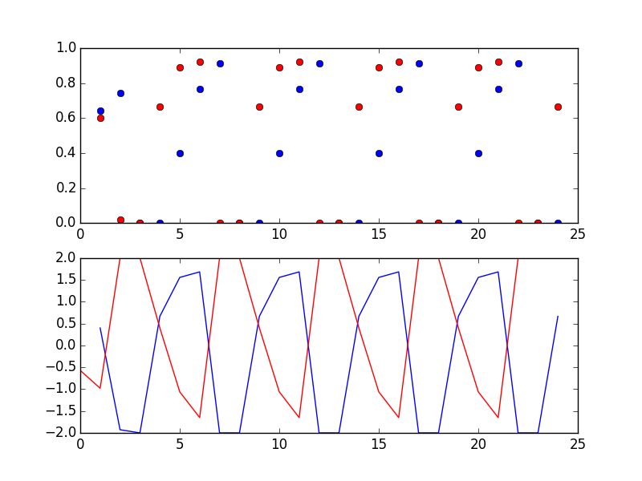

#+TITLE:    On Nash's theorem and computation of Nash equilibria
#+AUTHOR:    Christoph
#+EMAIL:    
#+DATE:      2015-08-07 Fri
#+DESCRIPTION:
#+KEYWORDS:
#+LANGUAGE:  en
#+OPTIONS:   H:3 num:t toc:nil \n:nil @:t ::t |:t ^:t -:t f:t *:t <:t
#+OPTIONS:   TeX:t LaTeX:t skip:nil d:nil todo:t pri:nil tags:not-in-toc
#+INFOJS_OPT: view:nil toc:nil ltoc:nil mouse:underline buttons:0 path:http://orgmode.org/org-info.js
#+EXPORT_SELECT_TAGS: export
#+EXPORT_EXCLUDE_TAGS: noexport
#+HTML_HEAD: 
#+HTML_HEAD: 

We showed that the function $f=(g,h)$ where
$$g(\alpha,\beta)=max\left\{0,\frac{\alpha+u_1(U,\beta)-u_1(D,\beta)}{1+|u_1(U,\beta)-u_1(D,\beta)|}\right\}$$
$$h(\alpha,\beta)=max\left\{0,\frac{\beta+u_2(L,\alpha)-u_2(R,\alpha)}{1+|\beta+u_2(L,\alpha)-u_2(R,\alpha)|}\right\}$$
has a fixed point using Brouwer's fixed point theorem. Since every fixed point of this function was an equilibrium of out 2x2 game, this proved equilibrium existence. To get a better idea how these $g$ and $h$ functions work, we are going to print and plot them here for a simple example: chicken 

#+CAPTION: Chicken
#+ATTR_HTML: :border 2 :rules all :frame border :align center
|                 | L $(\beta)$ | R $(1-\beta)$ |
|-----------------+-------------+---------------|
| U    $(\alpha)$ | 0,0         | 2,1           |
| D $(1-\alpha)$  | 1,2         | 1,1           |

We start with some arbitrary strategy profile, say $\alpha=0.5$ and $\beta=0.6$, and plug this into $f$. 

#+BEGIN_SRC python :session chicken :exports both :results output 
  from numpy import *
  import matplotlib.pyplot as plt
  import matplotlib
  from prettytable import PrettyTable

  ##payoffs from our 2x2 game; here chicken
  game = [[(0,0),(2,1)],[(1,2),(1,1)]] 
  ##strategy profile to start with; first entry is alpha, second is beta
  start = 0.5,0.6

  def g(a,b):
      utility_difference = b*game[0][0][0]+(1-b)*game[0][1][0]-b*game[1][0][0]-(1-b)*game[1][1][0]
      return max(0,(a+utility_difference)/(1+abs(utility_difference))), utility_difference

  def h(a,b):
      utility_difference = a*game[0][0][1]+(1-a)*game[1][0][1]-a*game[0][1][1]-(1-a)*game[1][1][1]
      return max(0,(b+utility_difference)/(1+abs(utility_difference))), utility_difference

  print g(start[0],start[1])[0],h(start[0],start[1])[0]
#+END_SRC

#+RESULTS:
: 
: >>> >>> >>> ... >>> ... >>> ... >>> >>> ... ... ... >>> ... ... ... >>> 0.25 0.6

Now some of you might have the following idea: If we plug the result again into $f$, will we get closer to some equilibrium? What if we repeatedly plug the results of $f$ back into $f$? Will we get to an equilibrium after enough repetitions? Well, let us try:

#+BEGIN_SRC python :session chicken :exports both :results output 
  index = range(1,25,1)
  x = start[0],0.,start[1],0.
  a_list = []#will contain the alpha values
  b_list = []# will contain the beta values
  d_u_1 = []# will contain utility difference between playing U and D
  d_u_2 = []# will contain utility difference between playing L and R

  t = PrettyTable(['alpha','beta'])

  for i in index:
      g_return = g(x[0],x[2])
      h_return = h(x[0],x[2])
      x = g_return[0],g_return[1],h_return[0],h_return[1]
      t.add_row([round(x[0],3),round(x[2],3)])
      a_list.append(x[0])
      d_u_1.append(x[1])
      b_list.append(x[2])
      d_u_2.append(x[3])

  print t

#+END_SRC

#+BEGIN_SRC python :session chicken  :results file
  matplotlib.use('Agg')
  d_u_1_shift = d_u_1[1:] + [x[2]*game[0][0][0]+(1-x[2])*game[0][1][0]-x[2]*game[1][0][0]-(1-x[2])*game[1][1][0]]
  d_u_2_shift = d_u_2[1:] + [x[0]*game[0][0][1]+(1-x[0])*game[1][0][1]-x[0]*game[0][1][1]-(1-x[0])*game[1][1][1]]

  plt.figure(1)
  plt.subplot(2,1,1)
  plt.plot(index,a_list,'bo',index,b_list,'ro')

  plt.subplot(2,1,2)
  plt.plot(index,d_u_1_shift,'b',d_u_2_shift,'r')
  plt.savefig('chicken.png')
  return 'chicken.png' 

#+END_SRC

#+CAPTION: Chicken: $\alpha$ and $\beta$ over several iterations (top panel) and corresponsing utility differences (bottom panel)
#+ATTR_HTML: :align center
[[./chicken.png]]

#+RESULTS:
#+begin_example

>>> >>> >>> >>> >>> >>> >>> >>> ... ... ... ... ... ... ... ... ... >>> +-------+-------+
| alpha |  beta |
+-------+-------+
|  0.25 |  0.6  |
| 0.042 | 0.733 |
|  0.0  | 0.861 |
|  0.0  |  0.93 |
|  0.0  | 0.965 |
|  0.0  | 0.983 |
|  0.0  | 0.991 |
|  0.0  | 0.996 |
|  0.0  | 0.998 |
|  0.0  | 0.999 |
|  0.0  | 0.999 |
|  0.0  |  1.0  |
|  0.0  |  1.0  |
|  0.0  |  1.0  |
|  0.0  |  1.0  |
|  0.0  |  1.0  |
|  0.0  |  1.0  |
|  0.0  |  1.0  |
|  0.0  |  1.0  |
|  0.0  |  1.0  |
|  0.0  |  1.0  |
|  0.0  |  1.0  |
|  0.0  |  1.0  |
|  0.0  |  1.0  |
+-------+-------+
>>> >>> >>> >>> >>> <matplotlib.figure.Figure object at 0x7fe0637f5810>
<matplotlib.axes._subplots.AxesSubplot object at 0x7fe0637f5690>
[<matplotlib.lines.Line2D object at 0x7fe05585a0d0>, <matplotlib.lines.Line2D object at 0x7fe05585a350>]
>>> <matplotlib.axes._subplots.AxesSubplot object at 0x7fe05585a9d0>
[<matplotlib.lines.Line2D object at 0x7fe0557f5190>, <matplotlib.lines.Line2D object at 0x7fe0557f5410>]
#+end_example

That seemed to work rather nicely. Will this always work? Unfortunately, the answer is "No". As an example, we do the same that we did above but this time we use the matching pennies game.

#+CAPTION: Matching pennies
#+ATTR_HTML: :border 2 :rules all :frame border :align center
|                 | L $(\beta)$ | R $(1-\beta)$ |
|-----------------+-------------+---------------|
| U    $(\alpha)$ | 1,-1        | -1,1          |
| D $(1-\alpha)$  | -1,1        | 1,-1          |

#+BEGIN_SRC python :session pennies :exports both :results output
  ##payoffs from our 2x2 game; here matching pennies
  from numpy import *
  import matplotlib.pyplot as plt
  import matplotlib
  from prettytable import PrettyTable
  #now we use matching pennies as our game
  game =[[(1.,-1.),(-1.,1.)],[(-1.,1.),(1.,-1.)]]
 
  ##strategy profile to start with; first entry is alpha, second is beta
  start = 0.5,0.6

  def g(a,b):
      utility_difference = b*game[0][0][0]+(1-b)*game[0][1][0]-b*game[1][0][0]-(1-b)*game[1][1][0]
      return max(0,(a+utility_difference)/(1+abs(utility_difference))), utility_difference

  def h(a,b):
      utility_difference = a*game[0][0][1]+(1-a)*game[1][0][1]-a*game[0][1][1]-(1-a)*game[1][1][1]
      return max(0,(b+utility_difference)/(1+abs(utility_difference))), utility_difference

  print g(start[0],start[1])[0],h(start[0],start[1])[0]

  index = range(1,25,1)
  x = start[0],0.,start[1],0.
  a_list = []#will contain the alpha values
  b_list = []# will contain the beta values
  d_u_1 = []# will contain utility difference between playing U and D
  d_u_2 = []# will contain utility difference between playing L and R

  t = PrettyTable(['alpha','beta'])

  for i in index:
      g_return = g(x[0],x[2])
      h_return = h(x[0],x[2])
      x = g_return[0],g_return[1],h_return[0],h_return[1]
      t.add_row([round(x[0],3),round(x[2],3)])
      a_list.append(x[0])
      d_u_1.append(x[1])
      b_list.append(x[2])
      d_u_2.append(x[3])

  print t

#+END_SRC

#+BEGIN_SRC python :session pennies :results file
  d_u_1_shift = d_u_1[1:] + [x[2]*game[0][0][0]+(1-x[2])*game[0][1][0]-x[2]*game[1][0][0]-(1-x[2])*game[1][1][0]]
  d_u_2_shift = d_u_2[1:] + [x[0]*game[0][0][1]+(1-x[0])*game[1][0][1]-x[0]*game[0][1][1]-(1-x[0])*game[1][1][1]]

  plt.figure(1)
  plt.subplot(2,1,1)
  plt.plot(index,a_list,'bo',index,b_list,'ro')

  plt.subplot(2,1,2)
  plt.plot(index,d_u_1_shift,'b',d_u_2_shift,'r')
  plt.savefig('matching_pennies.png')
  return 'matching_pennies.png' 

#+END_SRC

#+RESULTS:
| <matplotlib.lines.Line2D | object | at | 0x7fe0555b0590> | <matplotlib.lines.Line2D | object | at | 0x7fe05534b090> |

#+CAPTION: Matching pennies: $\alpha$ and $\beta$ over several iterations (top panel) and corresponsing utility differences (bottom panel)
#+ATTR_HTML: :align center
  

As you can see, there is some "cycling" going on: Instead of converging to the Nash equilibrium $(0.5,0.5)$, the strategies jump across the NE and repeat every few iterations. The important lesson from all this is the following: Nash's theorem proves that Nash equilibria exist (in finite games) but neither the theorem nor its proof gives us a way of how to compute the/a NE. More generally, fixed point theorems like Brouwer's theorem establish existence of a fixed point but do not help us to find the fixed point. Computation of Nash equilibria (in large but finite games) has been (and still is!) a topic in game theoretic research for a long time (see Herings, P. Jean-Jacques, and Ronald Peeters. "Homotopy methods to compute equilibria in game theory." /Economic Theory/ 42.1 (2010): 119-156 for a survey of some of this literature).
