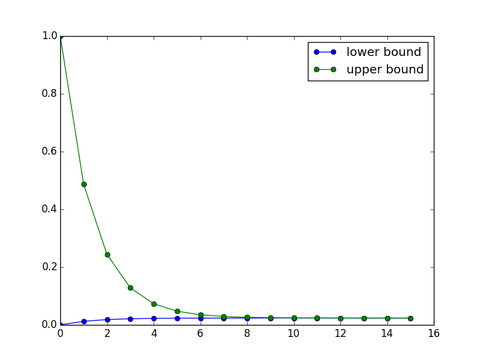

#+TITLE:    Simple, smooth supermodular games with concave utility
#+AUTHOR:    Christoph Schottmueller
#+EMAIL:    
#+DATE:     
#+DESCRIPTION:
#+KEYWORDS:
#+LANGUAGE:  en
#+OPTIONS:   H:3 num:t toc:nil \n:nil @:t ::t |:t ^:t -:t f:t *:t <:t 
#+OPTIONS:   TeX:t LaTeX:t skip:nil d:nil todo:t pri:nil tags:not-in-toc 
#+INFOJS_OPT: view:nil toc:nil ltoc:nil mouse:underline buttons:0 path:http://orgmode.org/org-info.js
#+EXPORT_SELECT_TAGS: export
#+EXPORT_EXCLUDE_TAGS: noexport
#+HTML_HEAD: 

We want to look again at the simple smooth supermodular games and add this time the assumption that 

$$\frac{\partial^2 u_i}{\partial a_i^2}<0.$$

Hence, the payoff of player $i$ is concave in his own action (actually quasiconcavity would be enough for the following arguments). In this case, the first order condition is sufficient for optimality. That is, player $i$'s best response is determined by the unique solution to 

$$\frac{\partial u_i}{\partial a_i}(a_i,a_{-i})=\begin{cases}=0 &\text{ if }a_i\in (\underline y_i,\bar y_i)\\ \leq0 &\text{ if }a_i=\underline y_i\\ \geq 0 &\text{ if }a_i = \bar y_i \end{cases}.$$

If the best response is interior (that is the first order condition holds with equality), then the implicit function theorem gives us the slope of the best response as 

$$ \frac{d\, br_i}{d\,a_j}(a_i,a_{-i})=-\frac{\frac{\partial ^2 u_i}{\partial a_i\partial a_j}(a_i,a_{-i})}{\frac{\partial ^2 u_i}{\partial a_i^2}(a_i,a_{-i})}\geq 0.$$

The best response function is increasing by the assumption of supermodularity. Since player $i$'s problem is concave and $u_i$ is assumed to be twice continuously differentiable, we also know that the best response is continuous. What does this imply?

- All actions between $br_i(\underline y_{-i})$ and $br_i(\bar y_{-i})$ are best responses to some action profile by the other players.

- Actions below $br_i(\underline y_{-i})$ (and above $br_i(\bar y_{-i})$) are never best responses.

We can say even a bit more. By supermodularity, all actions below $br_i(\underline y_{-i})$  are strictly dominated by $br_i(\underline y_{-i})$. This follows directly from the result we had in the lecture: 

/Let $a_i>a_i'$. If $u_i(a_i,a_{-i})>u_i(a_i',a_{-i})$, then $u_i(a_i,a_{-i}')>u_i(a_i',a_{-i}')$ for all $a_{-i}'\geq a_{-i}$./

     

* Serially undominated strategies

The results above imply that in the first round of the iterative elimination of dominated actions we will delete all actions below $br_i(\underline y_{-i})$ and above $br_i(\bar y_{-i})$.

What about the second round? Well we face the same problem as before just that the relevant action set is no longer $[\underline{y}_i,\bar{y}_i]$ but $[br_i(\underline{y}_{-i}),br_i(\bar{y}_{-i})]$. Hence, in the second round all actions below $br_i(br_{-i}(\underline{y}_{-j}))$ and above $br_i(br_{-i}(\bar{y}_{-j}))$ are eliminated. 

We can repeat this procedure round for round and as usual computers are better at iteration than humans. So let us write such a program for our simple search market. Given the parameter assumption $0<\alpha( N-1+\beta)<1$, we know that we can concentrate on $x_i\in[0,1]$ and the payoff of player $i$ is

$$u_i(x_i,x_{-i})=\alpha x_i\left(\sum_{j\neq i}x_j+\beta\right)-x_i^2$$
 
which is clearly concave. Furthermore, we can easily calculate the best response as

$$br_i(x_{-i})=\alpha \frac{\sum_{j\neq i}x_j+\beta}{2}.$$

The search market is actually particularly simple since all players are symmetric. Hence, the same actions will be dominated in any given round for each player.

#+BEGIN_SRC python :exports both :results output
  from prettytable import PrettyTable
  import matplotlib.pyplot as plt

  alpha = 0.05
  beta = 0.5
  N = 20

  #best response funtion
  def br(xj):
      return alpha*(sum(xj)+beta)/2

  #given a lower bound and an upper bound of the action set (which is the same for all players),
  #the function returns the lowest and highest best response 
  def elim(lb,ub):
      return [br([lb]*(N-1)), br([ub]*(N-1))]

  #now we will iterate the procedure of eliminating all
  #actions below the lowest and above the highest best response

  t = PrettyTable(['iteration','Lower bound','Upper bound'])

  x = [0,1] #initialization
  lb = [0.]
  ub = [1.]
  t.add_row([0]+x)
  for i in range(15):
      x = elim(x[0],x[1])
      t.add_row([i+1] + [round(x[0],5)] + [round(x[1],5)])
      lb.append(x[0])
      ub.append(x[1])

  print t

  fig, ax = plt.subplots()
  ax.plot(lb,'o-',label='lower bound')
  ax.plot(ub,'o-',label='upper bound')

  ax.legend(loc='upper right')
  plt.savefig('searchmbounds.png')
      

#+END_SRC

#+RESULTS:
#+begin_example
+-----------+-------------+-------------+
| iteration | Lower bound | Upper bound |
+-----------+-------------+-------------+
|     0     |      0      |      1      |
|     1     |    0.0125   |    0.4875   |
|     2     |   0.01844   |   0.24406   |
|     3     |   0.02126   |   0.12843   |
|     4     |    0.0226   |    0.0735   |
|     5     |   0.02323   |   0.04741   |
|     6     |   0.02354   |   0.03502   |
|     7     |   0.02368   |   0.02914   |
|     8     |   0.02375   |   0.02634   |
|     9     |   0.02378   |   0.02501   |
|     10    |    0.0238   |   0.02438   |
|     11    |    0.0238   |   0.02408   |
|     12    |   0.02381   |   0.02394   |
|     13    |   0.02381   |   0.02387   |
|     14    |   0.02381   |   0.02384   |
|     15    |   0.02381   |   0.02382   |
+-----------+-------------+-------------+
#+end_example

