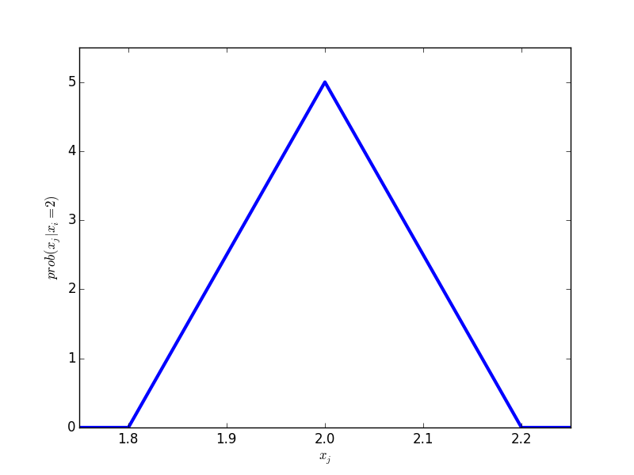

#+TITLE:    Global games
#+AUTHOR:    Christoph
#+EMAIL:    
#+DATE:      2015-08-07 Fri
#+DESCRIPTION:
#+KEYWORDS:
#+LANGUAGE:  en
#+OPTIONS:   H:3 num:t toc:nil \n:nil @:t ::t |:t ^:t -:t f:t *:t <:t 
#+OPTIONS:   TeX:t LaTeX:t skip:nil d:nil todo:t pri:nil tags:not-in-toc 
#+INFOJS_OPT: view:nil toc:nil ltoc:nil mouse:underline buttons:0 path:http://orgmode.org/org-info.js
#+EXPORT_SELECT_TAGS: export
#+EXPORT_EXCLUDE_TAGS: noexport
#+HTML_HEAD: 

We use the stag hunt as in Carlsson and van Damme (1993):

#+Caption: Stag hunt
#+ATTR_HTML: :frame border :rules all :align center 
|    | H2  | S2  |
|----+-----+-----|
| H1 | x,x | x,0 |
| S1 | 0,x | 4,4 |

where $x\in[-1,5]$ and each player draws an iid signal x_i from a uniform distribution on $[x-0.1,x+0.1]$. Ex ante each state $x\in[-1,5]$ is equally likely.

* Calculate beliefs over other player's signal

First, we use Bayes' rule to determine your belief over the true state x when your signal is x_i. With a slight abuse of notation we refer with "prob" to densities. We then get

$$prob(x|x_i) = \frac{prob(x_i|x) prob(x)}{prob(x_i)}=\begin{cases}0&\text{ if }x_i\not\in[x-0.1,x+0.1]\\ \frac{5*1/6}{5*0.2/6} &\text{ else}\end{cases}$$

which means that a player with signal x_i views all states in $[x_i-0.1,x_i+0.1]$ as equally likely (and all other states as impossible).

Now we turn to the question what is $prob(x_j|x_i)$? Well this is the same as 
$$prob(x_j |x_i)=\int_{-1}^{5}prob(x_j|x) prob(x|x_i) \,dx.$$
Note that $prob(x_j|x)$ is 5 if $x_j\in[x-0.1,x+0.1]$ and 0 otherwise.  We can therefore rewrite the expression as 
$$prob(x_j |x_i)=\int_{x_j-0.1}^{x_j+0.1}5 prob(x|x_i) \,dx.$$
From the expression for prob(x|x_i) above, we now already know that $prob(x_j|x_i)=0$ if $|x_j-x_i|>0.2$. Otherwise, we integrate 5*5 over $[x_i-0.1,x_i+0.1]\cap[x_j-0.1,x_j+0.1]$. Hence, we get $prob(x_j|x_i)=25*(0.2-|x_i-x_j|)$. Hence, the density $prob(x_j|x_i)$ is a triangle with density with its maximum at x_i.

#+BEGIN_SRC python :session :exports both :returns file
  from numpy import linspace
  from matplotlib import pyplot as plt

  xj = linspace(1.75,2.25,51)
  prob = [max(0,25*(0.2-abs(item -2))) for item in xj]

  fig = plt.figure()
  plt.axes(xlim=(1.75,2.25),ylim=(0,5.5))
  plt.xlabel('$x_j$')
  plt.ylabel('$prob(x_j|x_i=2)$')
  plt.plot(xj,prob,'b',linewidth = 3)

  plt.savefig('global_density.png')
  'global_density.png'
#+END_SRC

#+CAPTION: Density of player i's belief over $x_j$ given $x_i=2$
#+ATTR_HTML:   :align center
 

* Iterative elimination of strictly dominated strategies

If x<0, Si is a dominant strategy. If x_i<-0.1, player i knows that x<0 and it is therefore dominant to play Si. Similarly, if x>4, Hi is a dominant strategy. If x_i>4.1, player i knows that x>4 and it is therefore dominant to play Hi. 

It is important to understand that a strategy in this game is a function s_i: [-1.1,5.1]\rightarrow[0,1]. Put differently, a strategy gives for each signal that player i might get a probability with which he plays Si (he will play Hi with the counter probability). So we can plot a strategy in a figure where we have signals on the horizontal axis and the probability to play Si on the vertical axis.

What do our initial ideas about dominance mean in terms of the plot? Well it means that a rational player will choose probability 0 if x_i<-0.1 and probability 1 for x_i>4.1.

Now we will go a step further using dominance. By playing Hi, player i guarantees himself x. Given signal x_i\in[-0.1,4.1], the expected payoff from playing Hi is x_i because the beliefs of player i are symmetric. Consequently, player i should play Hi whenever he receives a  signal above 4: Then the expected payoff from playing Hi is above 4 which is the maximum payoff he can get when playing Si. Similarly, a player should play Si whenever he receives a signal x_i<0: In this case, the expected payoff from Hi is x_i<0 while the minimum payoff when playing Si is 0.

We can therefore conclude that the strategy of a rational player assigns 0 to all x_i<0 and 1 to all x_i>4.

So far we only utilized the fact that players are rational. Now we are going to utilize that they know that the other player is rational. Player i knows that j will play Sj whenever x_j<0. What should i do when he receives signal x_i=0.01? When he plays Hi, his expected payoff is 0.01. When he plays Si, his payoff is at least prob(x_j<0)*4 because j plays Sj when x_j<0. Given that x_i=0.01, prob(x_j<0) is (from i's point of view) almost 1/2. Hence, Si will give him a much larger payoff than Hi and a rational player i will play Si. Is the same true for x_i larger than 0.01? Well for slightly larger x_i it is. For much larger x_1 (e.g. x_i=0.2) we cannot say that prob(x_j<0) is large and therefore the argument does not work. Which is the largest x_i for which the argument works? This is the first question the program below answers (it turns out to be 0.146).

The program goes then further: We just established that a rational player who knows that the otehr player is rational plays Si whenever x_i<0.146. If i knows that j knows that i is rational, then i can expect j to play Sj whenever x_j<0.146. But what should i then do when x_i = 0.147? Playing Hi gives him an expected payoff of 0.147. Playing Si gives payoff 4*prob(x_j<0.146). As x_i=0.147, prob(x_j<0.146) is (from i's point of view) almost 1/2 and therefore Si gives the higher payoff. What is the highest x_i for which this argument works? It turns out to be 0.2722. 

Now we can iterate again. An, of course, we can do the same from above starting with 4.0. This is what the program below does.

#+BEGIN_SRC python :session global :exports both :results output

  from scipy import integrate
  from scipy import optimize
  from matplotlib import pyplot as plt
  from matplotlib import animation
  from prettytable import PrettyTable

  e = 0.1#epsilon

  #returns the expected utility of playing Si minus exp utility of playing Hi
  #input: cutoff of other player x in [0,1], own signal xi in [0,1]
  def DU(x,xi):
      def prob(x,y):#gives prob that xj<x given state y
          if x<=y-e:
              return 0
          elif x>=y+e:
              return 1
          else:
              return (x-(y-e))/(2*e)
      return integrate.quad(lambda y: prob(x,y)*4/(2*e),xi-e,xi+e )[0]-xi

  #best response function if other plays cutoff strategy with cutoff x\in[0,4]
  #returns a cutoff value: below Si is better; above Hi is better
  def br_co(x):
      return optimize.bisect(lambda y: DU(x,y),-0.01,4.01)

  t = PrettyTable(['iteration','lower cutoff','upper cutoff'])
  t.add_row([0,0.00,4.00])

  xl = [0.]
  xu = [4.]

  for j in range(100):
      xu.append(br_co(xu[j]))
      xl.append(br_co(xl[j]))
      if j<5 or (j+1)%5==0:
          t.add_row([j+1,round(xl[j+1],4),round(xu[j+1],4)])

  print t
#+END_SRC

#+RESULTS:
#+begin_example

>>> >>> >>> >>> >>> >>> ... ... ... ... ... ... ... ... ... ... ... >>> ... ... ... ... >>> >>> >>> >>> >>> >>> >>> >>> ... ... ... ... ... >>> +-----------+--------------+--------------+
| iteration | lower cutoff | upper cutoff |
+-----------+--------------+--------------+
|     0     |     0.0      |     4.0      |
|     1     |    0.146     |    3.854     |
|     2     |    0.2722    |    3.7278    |
|     3     |    0.3845    |    3.6155    |
|     4     |    0.4859    |    3.5141    |
|     5     |    0.5784    |    3.4216    |
|     10    |    0.9437    |    3.0563    |
|     15    |    1.2009    |    2.7991    |
|     20    |    1.3891    |    2.6109    |
|     25    |    1.5299    |    2.4701    |
|     30    |    1.6366    |    2.3634    |
|     35    |    1.7181    |    2.2819    |
|     40    |    1.7808    |    2.2192    |
|     45    |    1.8293    |    2.1707    |
|     50    |    1.8669    |    2.1331    |
|     55    |    1.896     |    2.104     |
|     60    |    1.9188    |    2.0812    |
|     65    |    1.9365    |    2.0635    |
|     70    |    1.9503    |    2.0497    |
|     75    |    1.9611    |    2.0389    |
|     80    |    1.9696    |    2.0304    |
|     85    |    1.9762    |    2.0238    |
|     90    |    1.9813    |    2.0187    |
|     95    |    1.9854    |    2.0146    |
|    100    |    1.9886    |    2.0114    |
+-----------+--------------+--------------+
#+end_example

Below we visualize the process. We plot for every iteration the part of the strategy function from which we know the following: A rational player who knows that the other player knows that....the other player is rational will use a strategy that features this function part. As you see, in the limit we end up with the complete strategy. Hence, there is a unique rationalizable strategy which is the cutoff strategy with cutoff 2.

#+BEGIN_SRC python :session global :exports both :results file
  fig = plt.figure()
  ax = plt.axes(xlim=(-1,5), ylim=(0,1))
  plt.ylabel('prob(Si)')
  plt.xlabel('$x_i$')
  line1, = ax.plot([],[],'b',linewidth=5)#not yet eliminated q1 on best response function
  line2, = ax.plot([],[],'r',linewidth=5)

  plt.legend([line1,line2],['only Si rational','only Hi rational'])

  from numpy import linspace

  #basic plot that is held fixed through out all iterations
  def init():
      xlow = linspace(-1,0,10)
      ylow = linspace(0,0,10)
      xhigh = linspace(4,5,10)
      yhigh = linspace(1.,1.,10)
      line1.set_data(xlow,ylow)
      line2.set_data(xhigh,yhigh)
      return line1,line2

  ub = [4.]
  lb = [0.]

  def animate(i):
      ub.append(br_co(ub[i]))
      lb.append(br_co(lb[i]))
      xlow = linspace(-1,lb[i+1],10)
      ylow = linspace(0,0,10)
      xhigh = linspace(ub[i+1],5,10)
      yhigh = linspace(1.,1.,10)
      line1.set_data(xlow,ylow)
      line2.set_data(xhigh,yhigh)
      return line1,line2

  anim = animation.FuncAnimation(fig,animate,init_func=init,frames=75,repeat=False,interval = 50,blit=True)

  anim.save('global_iterative.mp4',fps=10,extra_args=['-vcodec','libx264'])

  #plt.show()
  'global_iterative.mp4'

#+END_SRC

